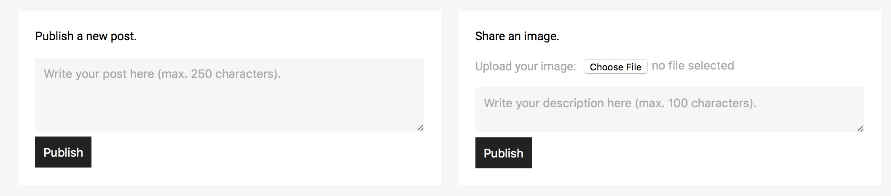

Kako napisati novo objavo?
==========================

Pisanje objav je sila preprosto. Pred pričetkom uporabe te storitve se morate **registrirati**, če se še niste, oz. **prijaviti** (več o registraciji in prijavi lahko preberete na strani :doc:`registracija` oz. :doc:`prijava`).

Ko ste se prijavili na spletno stran, ste prišli na **Časovnico** *(Timeline)*.

Časovnica (Timeline)
********************

Časovnica *(Timeline)* je sestavljena iz treh delov. 

* Povsem na vrhu je orodna vrstica, ki vam mogoča ogled lastnega profila *(View my profile)*, ogled všečkanih objav *(View favorited posts)*, ogled deljenih zapisov *(View shared posts)* in odjavo *(Log out)*.
* Pod orodno vrstico se nahajata prostora za vnos nove objave (več o tem spodaj).
* Zadnji del Časovnice pa sestavljajo zapisi uporabnikov, ki jim sledite.

Nova objava
***********

Če želite z uporabniki deliti samo besedilo, potem izpolnite polje Objavi nov zapis *(Publish a new post)*. Objava je lahko dolga največ 250 znakov.

Delite sliko
************

Če pa želite s svojimi bralci deliti fotografijo, potem uporabiti polje na desni strani Objavi novo fotografijo *(Share an image)*. Opis slike je lahko dolg največ 100 znakov. Fotografija bo prikazana na temnejšem ozadju, s klikom na njo pa si jo boste lahko ogledali v večjem formatu.

.. note:: 
	Vnosna polja ne smejo biti prazna. Tako ne morete objaviti zapisa brez besedila ali slikovne objave brez fotografije oz. opisa slike.