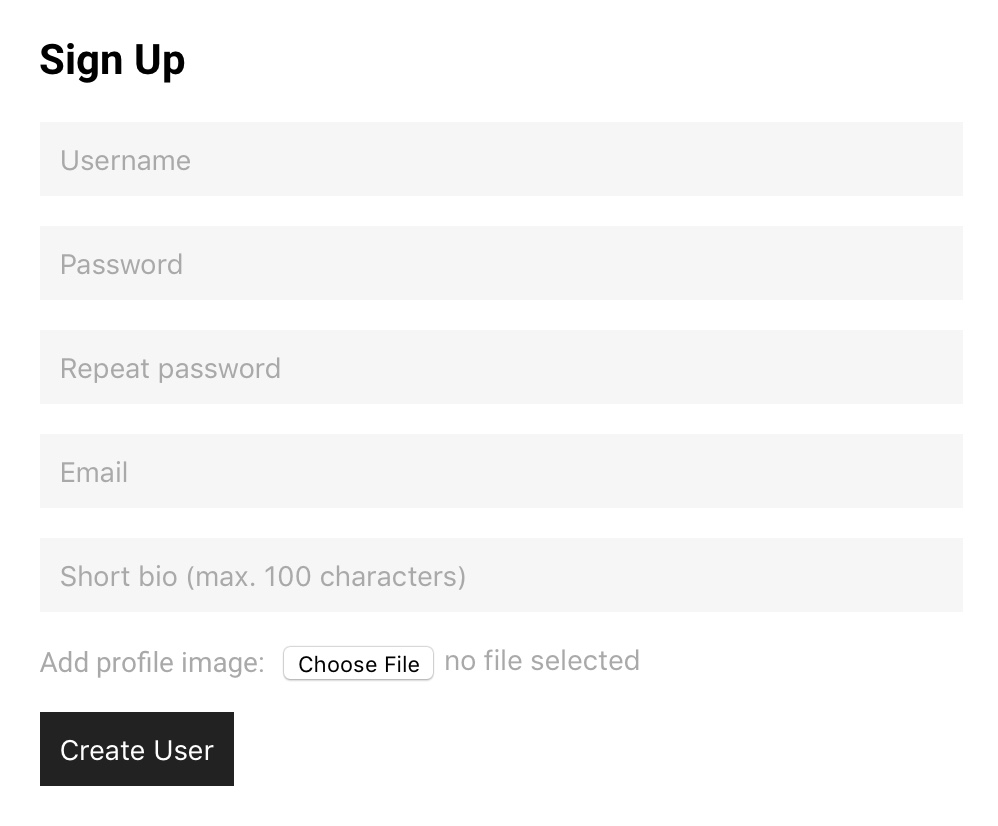

Registracija
============

Registracija je **zelo enostavna**, izvedena pa je v enem samem koraku. Izpolniti morate šest uporabniških polj. Če je bila registracija uspešna, boste avtomatično preusmerjeni na Časovnico (Timeline), kjer boste lahko začeli uporabljati storitev.

Katera polja je potrebno izpolniti?
************************************

1. *Uporabniško ime (username):* v to polje enostavno vnesite svoj ime in priimek. Z uporabniškim imenom se boste v nadaljevanju tudi prijavljali na spletno stran.

.. note::
	Če vnešeno uporabniško ime že obstaja in ga uporablja nek drug uporabnik, prijava ne bo uspešna.

2. *Geslo (password):* vnesite svoje geslo. Priporočljivo je, da geslo vsebuje velike in male začetnice, znake, številke in je primerno dolgo. Poskrbite za svojo varnost tudi na spletu!

3. *Ponovi geslo (repeat password):* potrdite vnešeno geslo iz drugega koraka.

.. note::
	Za uspešno registracijo mora biti geslo sestavljeno najmanj iz 8 znakov. Če se gesli ne ujemata bo registracija spodletela.

4. *Email (email):* sem vpišite svoj elektronski naslov. Vpisani elektronski naslov mora biti resničen, sicer se ne boste uspeli registrirati na spletno stran.

5. *Kratek življenjepis (short bio):* Da bodo bodoči obiskovalci vašega profila vedeli, kdo ste, napišite zanimiv in privlačen opis. Življenjepis je lahko sestavljen iz največ 100 znakov, na kar vas opozori tudi vmesnik.

6. *Dodaj profilno sliko (add profile image):* Zadnji korak pa je dodajanje profilne fotografije. Fotografija mora biti v formatu gif, jpg, jpeg ali png, ne sme biti težja od 1MB, po dimenzijah pa lahko meri največ 2048x1536 px.

.. note::
	Vsa polja so obvezna! Če jih ne boste izpolnili, registracija ne bo uspela.

	
	Na sliki vidite polja, ki jih boste morali izpolniti za uspešno registracijo.

.. seealso:: 
	:doc:`prijava` - Navodila, kako se prijaviti na spletno stran

