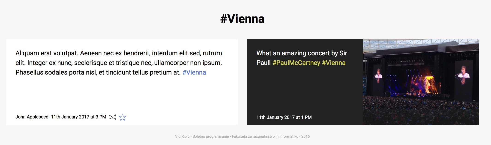

Kaj so značke?
==============

Značke *(tags)* so ključne besede, s katerimi lahko označite svoje zapise. Značka se od preostalih besed v zapisu razlikuje po tem, da se začne z znakom #. Ko bo zapis objavljen, se bo značka samodejno pretvorila v povezavo, na kateri boste lahko našli vse zapise, ki so označeni z isto ključno besedo.

Z značkami lahko dodate svojim zapisom nov pomen, hkrati pa lahko na ta način poiščete sorodne pisce in podobne objave.

.. seealso:: 
	:doc:`nova_objava`
	
	:doc:`deljenje_vseckanje_sledenje` - Kako deliti ali všečkati zapise drugih uporabnikov oz. kako jim slediti?

